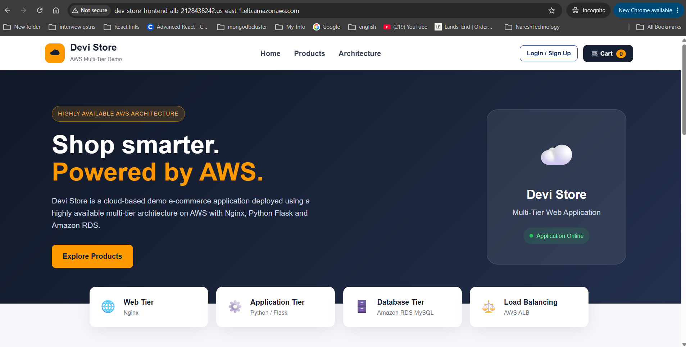
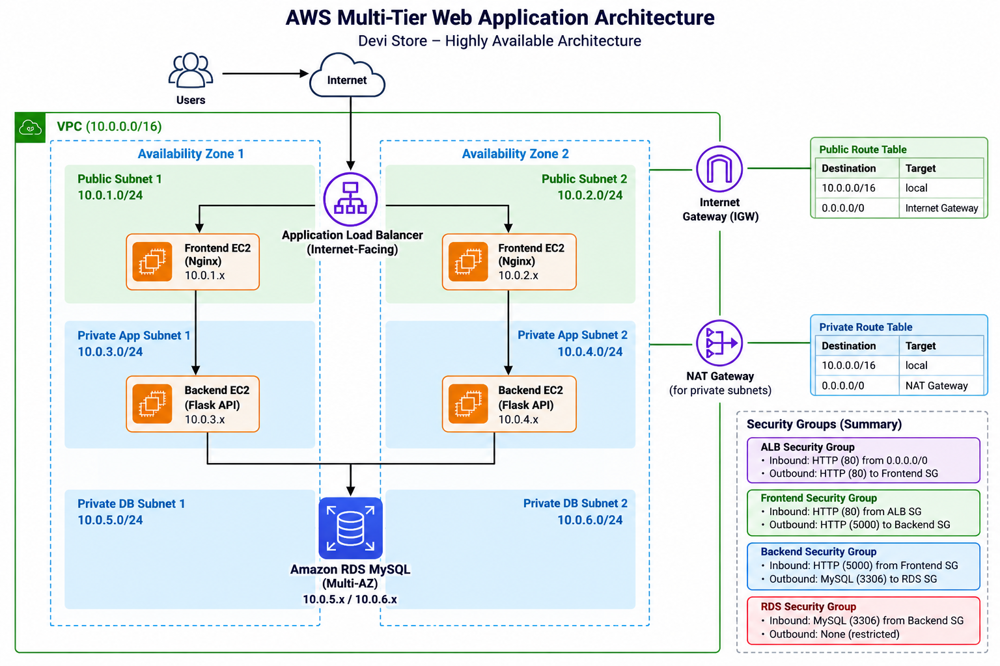

# AWS Multi-Tier Web Application Architecture

A multi-tier web application deployed on AWS using separate frontend, backend, and database tiers.

This project demonstrates practical implementation of AWS networking, EC2 application deployment, Application Load Balancing, Nginx reverse proxying, Flask REST APIs, Amazon RDS MySQL, Security Group-based tier communication, and real-world troubleshooting.

---

## Application Preview

### Devi Store — Running Through AWS Application Load Balancer



---

## Architecture



### Architecture Flow

```text
Internet
   ↓
Application Load Balancer
   ↓
Frontend EC2 / Nginx
   ↓
Backend EC2 / Flask API
   ↓
Amazon RDS MySQL
```

The application follows a multi-tier architecture:

- **Load Balancer Layer** — Application Load Balancer
- **Frontend Layer** — EC2 + Nginx
- **Backend Layer** — EC2 + Python Flask
- **Database Layer** — Amazon RDS MySQL

---

---

## AWS Services Used

- Amazon VPC
- Public and Private Subnets
- Internet Gateway
- NAT Gateway
- Route Tables
- Security Groups
- Amazon EC2
- Application Load Balancer
- Target Groups
- Amazon RDS MySQL
- AWS Systems Manager Session Manager

---

## Application Stack

### Frontend

- HTML
- CSS
- JavaScript
- Nginx

### Backend

- Python
- Flask
- REST APIs
- Flask Sessions
- Email OTP Verification

### Database

- MySQL
- Amazon RDS

---

## Application Features

The Devi Store application includes:

- Product catalog
- User registration
- Email OTP verification
- User login and logout
- Session-based authentication
- Shopping cart
- Checkout
- Shipping information
- Demo payment flow
- Order creation
- System health status

---

## Request Flow

A user request follows this path:

```text
User / Browser
      |
      v
Application Load Balancer
      |
      v
Frontend EC2
      |
      v
Nginx
      |
      | /api/*
      v
Backend EC2
      |
      v
Flask API
      |
      v
Amazon RDS MySQL
```

Nginx serves the static frontend application and forwards `/api` requests to the Flask backend.

---

## Network Design

The AWS environment was built using a custom VPC with public and private subnet architecture.

Internet-facing traffic enters through the Application Load Balancer.

The application tiers communicate using private networking.

The intended Security Group communication flow is:

```text
Internet
   |
   | HTTP :80
   v
ALB Security Group
   |
   | HTTP :80
   v
Frontend Security Group
   |
   | TCP :5000
   v
Backend Security Group
   |
   | TCP :3306
   v
RDS Security Group
```

This design separates the application tiers and prevents the backend application and database from requiring direct public application access.

---

## Nginx Reverse Proxy

Nginx runs on the Frontend EC2 instance.

Static application files are served from:

```text
/usr/share/nginx/html
```

Requests beginning with `/api` are forwarded to the Backend EC2 Flask application.

Example:

```nginx
location /api/ {
    proxy_pass http://BACKEND_PRIVATE_IP:5000/api/;
}
```

The frontend JavaScript uses relative API paths:

```text
/api/products
/api/register
/api/verify-otp
/api/login
/api/logout
/api/orders
/api/health
/api/me
```

This avoids hardcoding the Backend EC2 IP address into browser-side JavaScript.

---

## Database Design

The application uses the following MySQL database:

```text
devi_store
```

The database contains five main tables:

```text
users
email_otps
products
orders
order_items
```

Relationships include:

```text
users
  |
  | id
  v
orders.user_id


orders
  |
  | id
  v
order_items.order_id


products
  |
  | id
  v
order_items.product_id
```

The complete schema is stored in:

```text
database/schema.sql
```

The database uses `utf8mb4` to support Unicode application data.

---

## Configuration and Secrets

Environment-specific backend configuration is stored in:

```text
backend/.env
```

The real `.env` file is excluded from Git using `.gitignore`.

A safe configuration template is provided:

```text
backend/.env.example
```

Example configuration variables include:

```text
PORT
FLASK_DEBUG

DB_HOST
DB_USER
DB_PASSWORD
DB_NAME

MAIL_SERVER
MAIL_PORT
MAIL_USE_TLS
MAIL_USERNAME
MAIL_PASSWORD

SECRET_KEY
```

Passwords, database credentials, email App Passwords, and application secrets are not stored in the repository.

---

## AWS Deployment Process

The application was deployed in AWS using a layered approach, starting with the network infrastructure and then deploying the database, backend, frontend, and load balancer.

### Deployment Order

```text
VPC
 ↓
Public & Private Subnets
 ↓
Internet Gateway & NAT Gateway
 ↓
Route Tables
 ↓
Security Groups
 ↓
Amazon RDS MySQL
 ↓
Backend EC2 / Flask
 ↓
Frontend EC2 / Nginx
 ↓
Application Load Balancer
 ↓
End-to-End Application Testing
```

The deployment was completed in the following order:

1. Created the VPC and subnet architecture.
2. Configured the Internet Gateway.
3. Created the NAT Gateway for private subnet outbound access.
4. Configured public and private route tables.
5. Configured Security Groups for tier-to-tier communication.
6. Created the Amazon RDS MySQL database.
7. Launched the Backend EC2 instance.
8. Connected the Backend EC2 instance to Amazon RDS.
9. Imported the application database schema.
10. Deployed and tested the Flask backend API.
11. Launched the Frontend EC2 instance.
12. Configured Nginx as the web server and reverse proxy.
13. Verified Frontend EC2 → Backend EC2 connectivity.
14. Created the Application Load Balancer and frontend Target Group.
15. Registered the Frontend EC2 instance with the Target Group.
16. Verified the ALB target health.
17. Accessed and tested the complete application through the ALB DNS endpoint.

---

## Backend EC2 Deployment

### 1. Connect Using AWS Systems Manager

The Backend EC2 instance was accessed using AWS Systems Manager Session Manager instead of exposing SSH access.

---

### 2. Install Git

```bash
sudo yum install -y git
```

Verify:

```bash
git --version
```

---

### 3. Clone the Repository

```bash
git clone https://github.com/Devikamedam/aws-multitier-ha-web-architecture.git
```

Enter the repository:

```bash
cd aws-multitier-ha-web-architecture
```

---

### 4. Run Backend Setup

Make the deployment script executable:

```bash
chmod +x scripts/backend-setup.sh
```

Run the script and provide the RDS endpoint:

```bash
./scripts/backend-setup.sh <RDS_ENDPOINT>
```

The backend setup script performs the following tasks:

- Updates the EC2 instance packages
- Installs Python and required packages
- Installs the MySQL/MariaDB client
- Imports `database/schema.sql` into Amazon RDS
- Creates a Python virtual environment
- Installs application dependencies from `requirements.txt`

---

### 5. Configure Backend Environment

Create the environment file from the safe example:

```bash
cp backend/.env.example backend/.env
```

Edit the environment file:

```bash
vi backend/.env
```

Configure the environment-specific values:

```text
DB_HOST=<RDS_ENDPOINT>
DB_USER=admin
DB_PASSWORD=<RDS_PASSWORD>
DB_NAME=devi_store

MAIL_USERNAME=<EMAIL_ADDRESS>
MAIL_PASSWORD=<EMAIL_APP_PASSWORD>

SECRET_KEY=<APPLICATION_SECRET>
```

The real `.env` file is excluded from Git and application credentials are not stored in the repository.

---

### 6. Start the Flask Backend

Enter the backend directory:

```bash
cd backend
```

Activate the Python virtual environment:

```bash
source venv/bin/activate
```

Start the Flask application:

```bash
python app.py
```

---

### 7. Verify Backend API

Test the backend locally:

```bash
curl http://localhost:5000/api
```

Verify database-backed product retrieval:

```bash
curl http://localhost:5000/api/products
```

Successful responses confirm:

```text
Backend EC2
     |
     v
Flask API
     |
     v
Amazon RDS MySQL
```

---

## Frontend EC2 Deployment

### 1. Connect Using AWS Systems Manager

The Frontend EC2 instance was also accessed using AWS Systems Manager Session Manager.

---

### 2. Install Git

```bash
sudo yum install -y git
```

Verify:

```bash
git --version
```

---

### 3. Clone the Repository

```bash
git clone https://github.com/Devikamedam/aws-multitier-ha-web-architecture.git
```

Enter the repository:

```bash
cd aws-multitier-ha-web-architecture
```

---

### 4. Verify Frontend-to-Backend Connectivity

Before configuring Nginx, verify that the Frontend EC2 instance can communicate with the Flask backend using the Backend EC2 private IP:

```bash
curl http://<BACKEND_PRIVATE_IP>:5000/api
```

Verify products:

```bash
curl http://<BACKEND_PRIVATE_IP>:5000/api/products
```

This validates:

```text
Frontend EC2
     |
     | TCP :5000
     v
Backend EC2 / Flask
```

---

### 5. Run Frontend Setup

Make the deployment script executable:

```bash
chmod +x scripts/frontend-setup.sh
```

Run the script using the Backend EC2 private IP:

```bash
./scripts/frontend-setup.sh <BACKEND_PRIVATE_IP>
```

The frontend setup script:

- Updates the EC2 instance
- Installs Nginx
- Deploys the frontend files to the Nginx web root
- Configures the Nginx reverse proxy
- Replaces the backend IP placeholder
- Validates the Nginx configuration
- Enables and restarts Nginx

---

### 6. Validate Nginx

Check the Nginx configuration:

```bash
sudo nginx -t
```

Check the service:

```bash
sudo systemctl status nginx
```

Test the frontend locally:

```bash
curl http://localhost
```

---

### 7. Validate the Nginx Reverse Proxy

Test the backend API through Nginx:

```bash
curl http://localhost/api
```

Verify products:

```bash
curl http://localhost/api/products
```

The request now follows:

```text
Frontend
   |
   v
Nginx
   |
   | /api/*
   v
Backend EC2
   |
   v
Flask API
```

---

## Application Load Balancer Deployment

After validating the frontend and backend independently, the Application Load Balancer was configured.

### 1. Create Frontend Target Group

A target group was created for the Frontend EC2 application using:

```text
Protocol: HTTP
Port: 80
Target: Frontend EC2
```

---

### 2. Register Frontend EC2

The Frontend EC2 instance was registered with the target group.

Target health was verified before continuing.

```text
Frontend EC2
Status: Healthy
```

---

### 3. Create Internet-Facing ALB

An internet-facing Application Load Balancer was created in the public network layer.

The ALB receives HTTP traffic on port `80`.

```text
Internet
    |
    | HTTP :80
    v
Application Load Balancer
```

---

### 4. Configure ALB Listener

The ALB listener forwards requests to the frontend target group:

```text
HTTP :80
   |
   v
Frontend Target Group
   |
   v
Frontend EC2 :80
```

---

### 5. Verify Application Through ALB

The application was accessed using the ALB DNS endpoint.

The complete request path was verified as:

```text
Browser
   |
   v
Application Load Balancer
   |
   v
Frontend EC2
   |
   v
Nginx
   |
   | /api/*
   v
Backend EC2
   |
   v
Flask API
   |
   v
Amazon RDS MySQL
```

---

## End-to-End Validation

After deployment, the complete application functionality was tested through the ALB.

The validation included:

- Application homepage loading
- Product retrieval from RDS
- User registration
- Email OTP verification
- User login
- Session-based authentication
- Add to cart
- Checkout
- Shipping information
- Demo payment flow
- Order creation
- Database persistence
- Application health status

This confirmed successful communication across all application tiers:

```text
Internet
   ↓
ALB
   ↓
Frontend EC2 / Nginx
   ↓
Backend EC2 / Flask
   ↓
Amazon RDS MySQL
```

## Troubleshooting

Several real deployment issues were identified and resolved during implementation.

### Backend to RDS Connectivity

The backend initially could not connect to Amazon RDS.

The Security Group and network path were investigated and corrected to allow MySQL communication on port `3306`.

### Frontend to Backend Connectivity

The Frontend EC2 instance initially could not communicate with the Flask application.

Backend access on port `5000` was corrected and connectivity was verified using `curl`.

### Nginx Reverse Proxy 404

The backend API worked directly, but `/api` requests through Nginx returned `404`.

The active Nginx configuration was inspected using:

```bash
sudo nginx -T
```

A conflicting default Nginx port-80 server configuration was identified.

After resolving the conflict, `/api` requests were successfully routed to Flask.

### Product Icon Encoding

Some product icons appeared as question marks.

The issue was traced through:

```text
Frontend → API → RDS
```

The database values were inspected and corrected.

The database schema now uses `utf8mb4`, and seed icons use UTF-8 hexadecimal values to prevent source-file encoding corruption.

### Checkout HTTP 500

Checkout initially returned:

```text
POST /api/orders → 500
```

Backend logs showed that the `orders` table did not exist.

The original schema contained only:

```text
users
email_otps
products
```

The missing tables were added:

```text
orders
order_items
```

After updating the schema, checkout completed successfully.

Detailed troubleshooting is available in:

```text
docs/troubleshooting.md
```

---

## Screenshots / Implementation Evidence

The `screenshots/` directory contains implementation evidence from the AWS deployment.

Examples include:

```text
01-vpc-subnets.png
02-public-route-table-igw.png
03-private-route-table-nat.png
04-rds-mysql-instance.png
05-backend-ec2-ssm-access.png
06-backend-rds-connectivity.png
07-database-schema-tables.png
08-backend-api-working.png
09-backend-rds-products-api.png
10-frontend-to-backend-connectivity.png
11-nginx-reverse-proxy-api.png
12-alb-frontend-target-healthy.png
13-application-via-alb.png
14-alb-dns-application-working.png
```

These screenshots provide evidence of networking, application deployment, database connectivity, API communication, reverse proxy configuration, load balancing, and end-to-end application access.

---

## Repository Structure

```text
aws-multitier-ha-web-architecture/
│
├── app-config/
│   └── nginx.conf
│
├── architecture/
│   └── aws-multitier-ha-architecture.png
│
├── backend/
│   ├── .env.example
│   ├── app.py
│   ├── README.md
│   └── requirements.txt
│
├── database/
│   └── schema.sql
│
├── docs/
│   ├── implementation-guide.md
│   └── troubleshooting.md
│
├── frontend/
│   ├── index.html
│   ├── style.css
│   └── app.js
│
├── screenshots/
│
├── scripts/
│   ├── backend-setup.sh
│   └── frontend-setup.sh
│
├── .gitignore
└── README.md
```

---

## Key Engineering Takeaways

This project demonstrates hands-on experience with:

- AWS multi-tier application architecture
- VPC networking
- Public and private subnet design
- Internet Gateway and NAT Gateway routing
- Security Group-based tier isolation
- EC2 application deployment
- AWS Systems Manager Session Manager
- Application Load Balancer
- Target Groups
- Nginx reverse proxy configuration
- Python Flask API deployment
- Amazon RDS MySQL integration
- Environment-based application configuration
- Database schema management
- REST API troubleshooting
- Linux service troubleshooting
- Layer-by-layer application validation

---

## Security Considerations

The architecture follows tier-based access principles:

- Internet traffic enters through the internet-facing ALB.
- Frontend application access is controlled through the ALB tier.
- Backend application traffic is restricted to the frontend tier.
- Database traffic is restricted to the backend tier.
- EC2 administrative access uses AWS Systems Manager instead of exposing SSH.
- Application secrets are stored outside source control.
- `.env` is excluded using `.gitignore`.
- Only `.env.example` is stored in Git.

---

## Project Status

The core AWS multi-tier architecture and application flow were successfully deployed and validated.

The completed application path was:

```text
Browser
   ↓
Application Load Balancer
   ↓
Frontend EC2 / Nginx
   ↓
Backend EC2 / Flask
   ↓
Amazon RDS MySQL
```

The deployment validated:

- AWS networking
- Tier-to-tier connectivity
- ALB routing
- Nginx reverse proxying
- Flask REST APIs
- RDS database connectivity
- User registration
- Email OTP verification
- Login/logout
- Product retrieval
- Shopping cart
- Checkout
- Order processing
- End-to-end application access

The project also documents the troubleshooting process used to identify and resolve infrastructure, networking, application, database, and encoding issues.
